# hse_hw1_meth

[колаб](https://colab.research.google.com/drive/1qzvO8MXqGz-VJmJjl9BWOwZRfCPvppO1#scrollTo=I4JWS2QOxd_U)

## Сравнение fastqc

### Для начала посмотрим на обычные fastqc файлы взятые из какой-то старой домашки

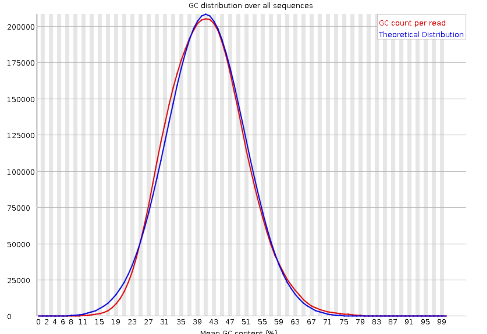
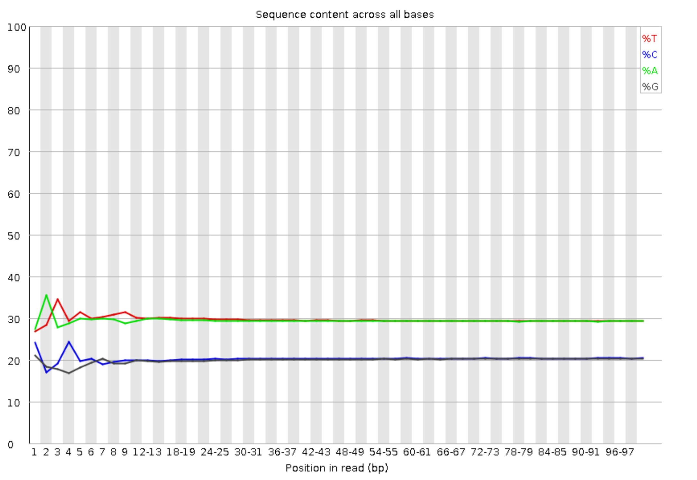
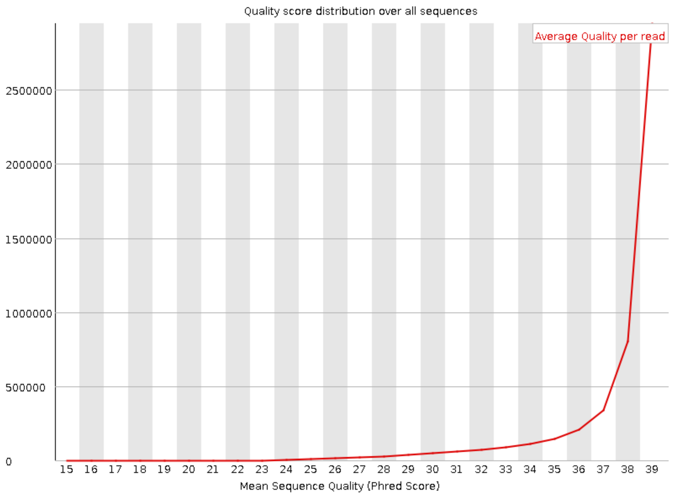

### Теперь посмотрим на fastqc BS-Seq

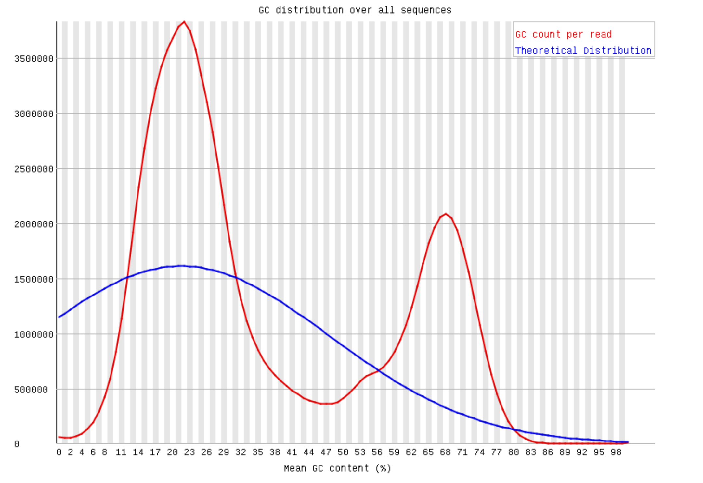
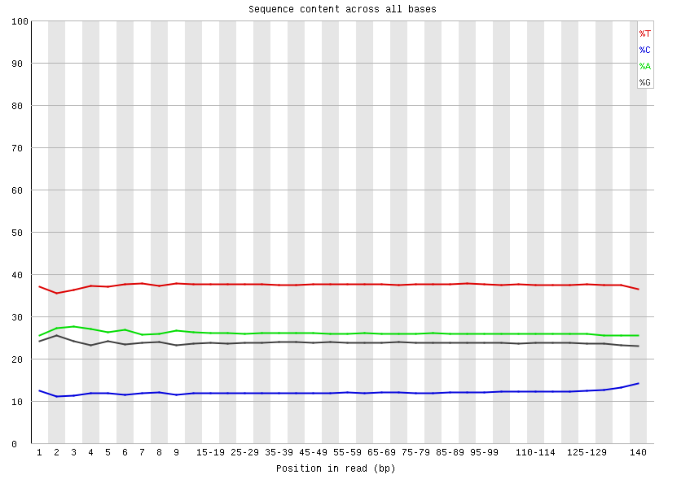
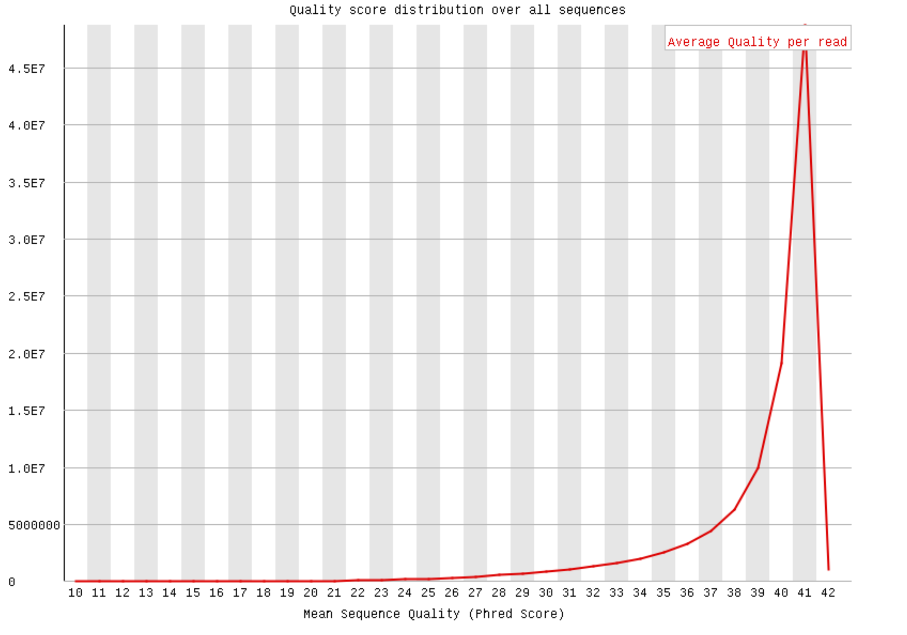

Заметно отличается GC content — у BS-seq он далек от теоретического распредиления. Также у BS-seq более гладкое распределение по нуклеотидам. Помимо этого, у BS-seq сильно падает качество к концу чтения.

## Статистики

Я сразу использовал параллельную дедупликацию, она в колабе.

### 8cell

* ридов на 11347700-11367700: 1090
* ридов на 40185800-40195800: 464
* дупликаций: 18.31%

### Epiblast

* ридов на 11347700-11367700: 2328
* ридов на 40185800-40195800: 1062
* дупликаций: 2.92%

### ICM

* ридов на 11347700-11367700: 1456
* ридов на 40185800-40195800: 630
* дупликаций: 9.08%

## M-bias

### 8cell
#### 1 рид

#### 2 рид
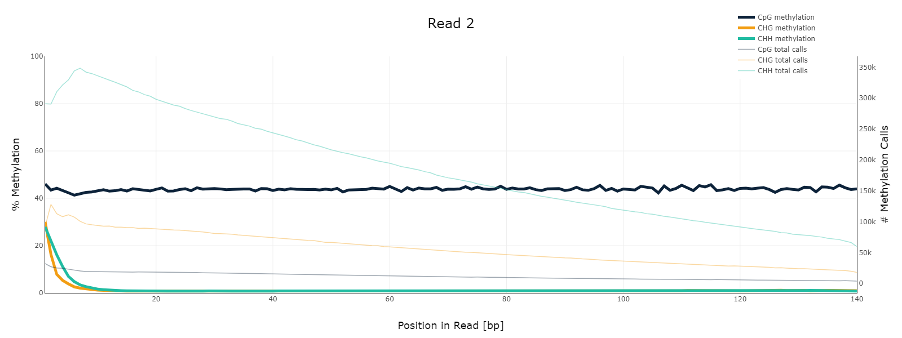

### Epiblast
#### 1 рид

#### 2 рид
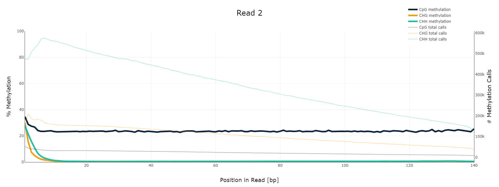

### ICM
#### 1 рид
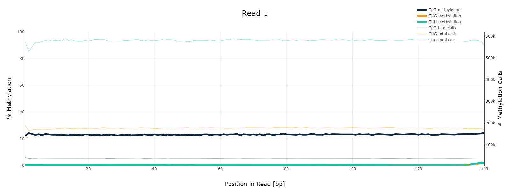
#### 2 рид

CPG составляет ~40% и ~20%.

## Гистограммы

Код по гистограмме также в colab.

### 8cell
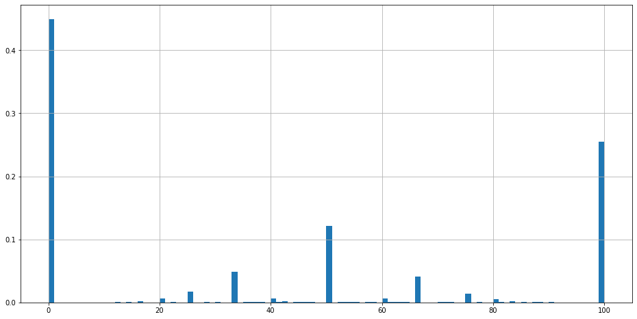

### Epiblast
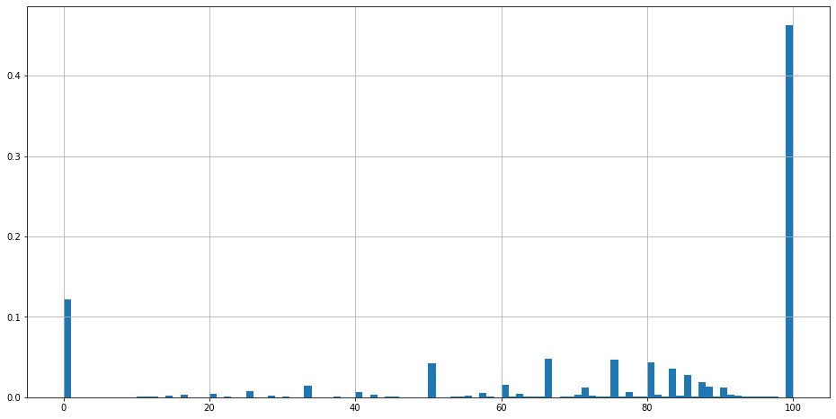

### ICM
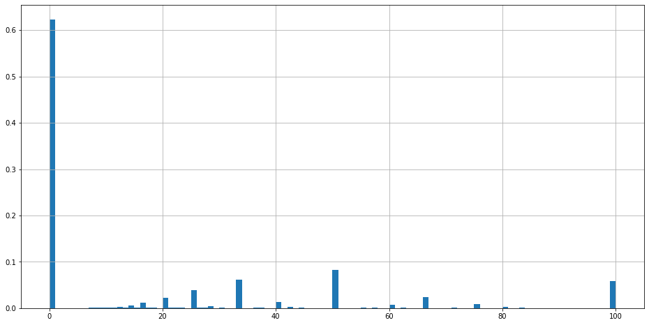

Уровень CPG совпадает с тем, что показывает гистограмма.

## Покрытие

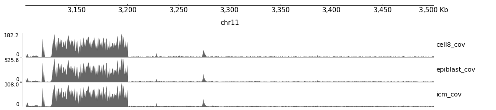

## Метилирование

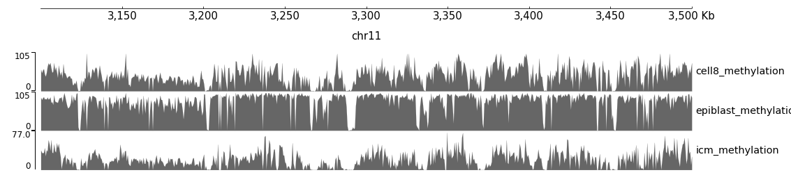
